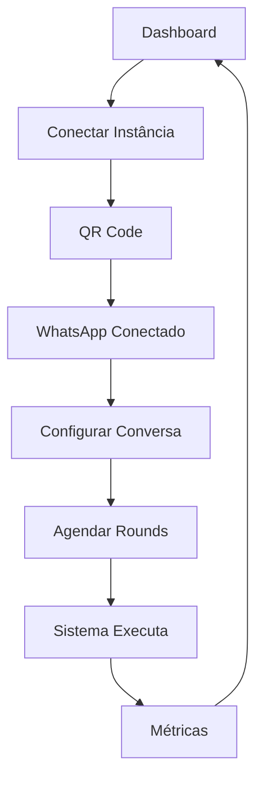

# Mirage WhatsApp Orchestrator - Documento de Requisitos de Produto

## 1. Visão Geral do Produto

O Mirage WhatsApp Orchestrator é um SaaS multi-tenant que orquestra múltiplas instâncias do WhatsApp para criar conversas naturais automatizadas entre bots e realizar outreach controlado para contatos humanos. O sistema conecta instâncias via Evolution API, gerencia conversas com cadência humana e oferece métricas detalhadas de performance.

O produto resolve o problema de automação em escala do WhatsApp mantendo naturalidade nas conversas e conformidade com políticas de uso, oferecendo controles granulares de horários, limites e personas para diferentes tipos de interação.

## 2. Funcionalidades Principais

### 2.1 Papéis de Usuário

| Papel | Método de Registro | Permissões Principais |
|-------|-------------------|----------------------|
| Admin | Convite do sistema | Gerenciar tenant, usuários, todas as configurações |
| Operador | Convite do admin | Configurar conversas, personas, métricas |
| Visualizador | Convite do admin | Apenas visualizar métricas e status |

### 2.2 Módulos Funcionais

Nosso sistema consiste nas seguintes páginas principais:

1. **Dashboard de Instâncias**: gerenciamento de conexões WhatsApp, status em tempo real, QR codes
2. **Configurações Globais**: delays, limites, horários de silêncio, políticas gerais
3. **Gestão de Conversas**: configuração de participantes, tópicos, agendamento
4. **Personas e Contatos**: CRUD de personas e base de contatos
5. **Outreach**: políticas e targets para contato com humanos externos
6. **Métricas e Analytics**: dashboards com gráficos de performance

### 2.3 Detalhes das Páginas

| Página | Módulo | Descrição da Funcionalidade |
|--------|--------|-----------------------------|
| Dashboard de Instâncias | Conexões WhatsApp | Conectar instâncias via QR code, monitorar status realtime, gerenciar sessões ativas |
| Dashboard de Instâncias | Cards de Status | Exibir contadores de mensagens (hoje/7d), latência, ações rápidas |
| Configurações Globais | Delays e Limites | Configurar min/max delay, burst limits, quiet hours globais |
| Configurações Globais | Políticas Gerais | Ativar/desativar bot-to-bot, humanização, anti-echo |
| Gestão de Conversas | Participantes | Adicionar pares/grupos de bots, definir ordem de início |
| Gestão de Conversas | Agendamento | Calendário semanal com janelas manhã/tarde/noite, rounds e pausas |
| Gestão de Conversas | Tópicos | Seeds de conversa, system prompts por tópico, períodos ativos |
| Personas | CRUD Personas | Criar personas com saudações por período, estilos de conversa |
| Contatos | Base de Contatos | Upload CSV, tags, notas, gerenciamento de contatos externos |
| Outreach | Políticas | Limites diários/horários, gaps mínimos, dayparts permitidos |
| Outreach | Targets | Status pending/in_progress/done/optout, priorização |
| Métricas | Gráficos Gerais | Mensagens por dia, enviadas vs recebidas, heatmap horário |
| Métricas | Analytics Avançados | Ranking de tópicos, latência por número, debug de mensagens |

## 3. Processo Principal

### Fluxo do Administrador
1. Conecta instâncias WhatsApp via QR code no dashboard
2. Configura personas e importa base de contatos
3. Cria conversas definindo participantes e tópicos
4. Agenda janelas de atividade (manhã/tarde/noite)
5. Define políticas de outreach para contatos externos
6. Monitora métricas e ajusta configurações

### Fluxo do Sistema Automatizado
1. Scheduler verifica janelas ativas e inicia rounds de conversa
2. Workers geram respostas via OpenAI respeitando personas
3. Mensagens são enviadas com delays naturais via Evolution API
4. Webhooks capturam respostas e alimentam próximas interações
5. Sistema respeita limites, quiet hours e opt-outs

## 4. Design da Interface

### 4.1 Estilo de Design

- **Cores Primárias**: Zinc/Slate como base neutra, acentos neon ciano/roxo sutis
- **Estilo de Botões**: Rounded-2xl com shadow-md, estados hover/focus bem definidos
- **Tipografia**: Inter ou similar, tamanhos 14px (corpo), 16px (títulos), 12px (labels)
- **Layout**: Grid responsivo, cards com spacing generoso, dark mode por padrão
- **Ícones**: Lucide React para consistência, estilo minimalista

### 4.2 Visão Geral do Design das Páginas

| Página | Módulo | Elementos de UI |
|--------|--------|----------------|
| Dashboard | Cards de Instância | Grid responsivo, badges de status, progress bars para conexão |
| Dashboard | Modal QR | Dialog centralizado, QR code grande, polling de status |
| Configurações | Formulários | Inputs com validação Zod, toggles, sliders para delays |
| Conversas | Calendário | Grid 7x3 (dias x períodos), toggles por janela, inputs de tempo |
| Métricas | Gráficos | Recharts com tema dark, tooltips informativos, filtros por período |
| Outreach | Tabelas | Sorting, filtering, badges de status, ações em linha |

### 4.3 Responsividade

O produto é desktop-first com adaptação mobile. Utiliza breakpoints Tailwind padrão, com navegação colapsável em mobile e otimização para touch em tablets. Componentes críticos como QR codes e métricas são otimizados para visualização em dispositivos menores.