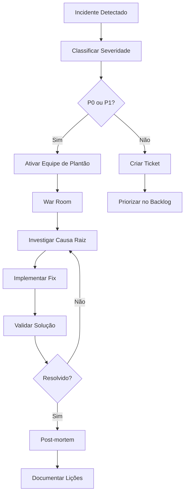

# Análise de Riscos e Mitigações - Mirage WhatsApp Orchestrator

## Matriz de Riscos

### Classificação de Probabilidade
- **Baixa (1)**: < 20% de chance
- **Média (2)**: 20-60% de chance  
- **Alta (3)**: > 60% de chance

### Classificação de Impacto
- **Baixo (1)**: Inconveniente, sem impacto no negócio
- **Médio (2)**: Impacto moderado, funcionalidade degradada
- **Alto (3)**: Impacto severo, perda de receita
- **Crítico (4)**: Impacto catastrófico, risco legal/reputacional

### Score de Risco = Probabilidade × Impacto

---

## 1. Riscos de Conformidade e Legais

### 1.1 Violação dos Termos de Serviço do WhatsApp

**Probabilidade**: Alta (3) | **Impacto**: Crítico (4) | **Score**: 12

#### Descrição
O WhatsApp possui termos rigorosos contra automação e uso comercial não autorizado. Violações podem resultar em:
- Ban permanente de números
- Ações legais da Meta
- Perda total da funcionalidade

#### Cenários de Risco
- Envio de mensagens em massa
- Padrões não-humanos de comportamento
- Uso de APIs não oficiais
- Spam ou conteúdo inadequado

#### Mitigações Implementadas

**Técnicas:**
```typescript
// Delays humanizados
const HUMAN_DELAYS = {
  min: 15000, // 15s
  max: 180000, // 3min
  typing: [2000, 8000] // 2-8s
};

// Limites conservadores
const DAILY_LIMITS = {
  messages_per_number: 50,
  new_conversations: 10,
  outreach_contacts: 20
};
```

**Operacionais:**
- Quiet hours obrigatórias (22h-8h)
- Gaps mínimos entre mensagens (15s-3min)
- Rotação de números para distribuir carga
- Monitoramento de padrões suspeitos

**Contratuais:**
- Termos de uso claros para usuários
- Disclaimer sobre riscos
- Responsabilidade do usuário final

#### Plano de Contingência
1. **Detecção de Ban**: Monitoramento automático de status
2. **Isolamento**: Pausar operações do número afetado
3. **Rotação**: Ativar números backup
4. **Análise**: Identificar causa raiz
5. **Ajuste**: Modificar parâmetros de segurança

---

### 1.2 Problemas de Privacidade e LGPD

**Probabilidade**: Média (2) | **Impacto**: Alto (3) | **Score**: 6

#### Descrição
Manipulação inadequada de dados pessoais pode resultar em:
- Multas da ANPD (até 2% do faturamento)
- Processos judiciais
- Perda de confiança dos usuários

#### Cenários de Risco
- Vazamento de conversas
- Compartilhamento não autorizado de contatos
- Falta de consentimento para processamento
- Ausência de mecanismos de exclusão

#### Mitigações Implementadas

**Técnicas:**
```sql
-- Criptografia de dados sensíveis
CREATE TABLE t_messages (
    id UUID PRIMARY KEY,
    content TEXT, -- Criptografado em aplicação
    content_hash VARCHAR(64), -- Para deduplicação
    encrypted_metadata JSONB
);

-- Retenção automática
CREATE OR REPLACE FUNCTION cleanup_old_messages()
RETURNS void AS $$
BEGIN
    DELETE FROM t_messages 
    WHERE created_at < NOW() - INTERVAL '90 days';
END;
$$ LANGUAGE plpgsql;
```

**Processuais:**
- Consentimento explícito para coleta
- Opt-out imediato disponível
- Retenção limitada (90 dias)
- Logs de auditoria completos

---

## 2. Riscos Técnicos

### 2.1 Instabilidade da Evolution API

**Probabilidade**: Alta (3) | **Impacto**: Alto (3) | **Score**: 9

#### Descrição
A Evolution API é um middleware crítico. Falhas podem causar:
- Perda de mensagens
- Desconexão de instâncias
- Inconsistência de dados

#### Cenários de Risco
- Crashes frequentes do serviço
- Mudanças breaking na API
- Rate limiting inesperado
- Problemas de conectividade

#### Mitigações Implementadas

**Circuit Breaker:**
```typescript
class EvolutionApiClient {
  private circuitBreaker = new CircuitBreaker({
    failureThreshold: 5,
    resetTimeout: 30000,
    monitoringPeriod: 60000
  });

  async sendMessage(data: SendMessageDto) {
    return this.circuitBreaker.execute(() => 
      this.httpService.post('/message/sendText', data)
    );
  }
}
```

**Retry com Backoff:**
```typescript
const retryConfig = {
  retries: 3,
  retryDelay: (retryCount) => Math.pow(2, retryCount) * 1000,
  retryCondition: (error) => 
    error.response?.status >= 500 || error.code === 'ECONNRESET'
};
```

**Health Monitoring:**
- Ping a cada 30s
- Alertas automáticos em falhas
- Fallback para modo manual

---

### 2.2 Sobrecarga do Sistema de Filas

**Probabilidade**: Média (2) | **Impacto**: Médio (2) | **Score**: 4

#### Descrição
Volume alto de mensagens pode sobrecarregar o BullMQ:
- Delays excessivos no processamento
- Perda de jobs
- Consumo excessivo de memória

#### Mitigações Implementadas

**Auto-scaling de Workers:**
```typescript
// Configuração dinâmica baseada na fila
const workerConfig = {
  concurrency: process.env.NODE_ENV === 'production' ? 10 : 2,
  limiter: {
    max: 100, // jobs por minuto
    duration: 60000
  }
};

// Monitoramento de fila
queue.on('waiting', (jobId) => {
  if (queue.waiting > 1000) {
    logger.warn('Queue overload detected', { waiting: queue.waiting });
    // Escalar workers ou pausar novos jobs
  }
});
```

**Priorização de Jobs:**
```typescript
enum JobPriority {
  CRITICAL = 1,    // Respostas a humanos
  HIGH = 5,        // Outreach programado
  NORMAL = 10,     // Conversas bot-bot
  LOW = 20         // Métricas e cleanup
}
```

---

### 2.3 Rate Limits da OpenAI

**Probabilidade**: Média (2) | **Impacto**: Médio (2) | **Score**: 4

#### Descrição
Limites da API OpenAI podem bloquear geração de respostas:
- Tier limits (RPM/TPM)
- Custos elevados
- Latência alta

#### Mitigações Implementadas

**Cache Inteligente:**
```typescript
class AIResponseCache {
  async getCachedResponse(context: string, persona: string): Promise<string | null> {
    const key = `ai_response:${hash(context + persona)}`;
    return this.redis.get(key);
  }

  async cacheResponse(context: string, persona: string, response: string) {
    const key = `ai_response:${hash(context + persona)}`;
    await this.redis.setex(key, 3600, response); // 1h TTL
  }
}
```

**Fallback Responses:**
```typescript
const FALLBACK_RESPONSES = {
  greeting: ["Oi! Como você está?", "Olá! Tudo bem?"],
  continuation: ["Interessante...", "Entendi", "Faz sentido"],
  closing: ["Foi ótimo conversar!", "Até mais!"]
};
```

---

## 3. Riscos Operacionais

### 3.1 Ban de Números WhatsApp

**Probabilidade**: Média (2) | **Impacto**: Alto (3) | **Score**: 6

#### Descrição
Números podem ser banidos por:
- Comportamento suspeito
- Denúncias de usuários
- Padrões automatizados detectados

#### Mitigações Implementadas

**Sistema de Rotação:**
```typescript
class NumberRotationService {
  async getAvailableNumber(tenantId: string): Promise<WhatsAppNumber> {
    // Buscar número com menor uso nas últimas 24h
    const number = await this.db.query(`
      SELECT * FROM t_numbers 
      WHERE tenant_id = $1 
        AND status = 'active'
        AND daily_message_count < 50
      ORDER BY daily_message_count ASC, last_used_at ASC
      LIMIT 1
    `, [tenantId]);
    
    return number;
  }
}
```

**Monitoramento de Saúde:**
```typescript
// Verificação automática de status
setInterval(async () => {
  const numbers = await this.getActiveNumbers();
  
  for (const number of numbers) {
    const status = await this.evolutionApi.getInstanceStatus(number.instance_name);
    
    if (status === 'disconnected') {
      await this.handleDisconnectedNumber(number);
    }
  }
}, 60000); // A cada minuto
```

**Plano de Contingência:**
1. **Detecção**: Status check automático
2. **Isolamento**: Pausar operações do número
3. **Notificação**: Alertar administradores
4. **Rotação**: Ativar número backup
5. **Análise**: Investigar causa do ban

---

### 3.2 Classificação como Spam

**Probabilidade**: Média (2) | **Impacto**: Alto (3) | **Score**: 6

#### Descrição
Mensagens podem ser classificadas como spam por:
- Conteúdo repetitivo
- Envio para desconhecidos
- Falta de contexto
- Denúncias de usuários

#### Mitigações Implementadas

**Variação de Conteúdo:**
```typescript
class MessageVariationService {
  generateVariations(template: string): string[] {
    const variations = [
      template,
      template.replace(/oi/gi, 'olá'),
      template.replace(/tudo bem/gi, 'como vai'),
      // Mais variações...
    ];
    
    return variations;
  }
  
  async getRandomVariation(template: string): Promise<string> {
    const variations = this.generateVariations(template);
    return variations[Math.floor(Math.random() * variations.length)];
  }
}
```

**Opt-out Automático:**
```typescript
const OPT_OUT_KEYWORDS = [
  'pare', 'stop', 'sair', 'cancelar', 'remover',
  'não quero', 'desinscrever', 'spam'
];

class OptOutService {
  async processMessage(message: string, fromNumber: string): Promise<boolean> {
    const hasOptOutKeyword = OPT_OUT_KEYWORDS.some(keyword => 
      message.toLowerCase().includes(keyword)
    );
    
    if (hasOptOutKeyword) {
      await this.addToBlacklist(fromNumber);
      await this.sendOptOutConfirmation(fromNumber);
      return true;
    }
    
    return false;
  }
}
```

---

## 4. Riscos de Segurança

### 4.1 Vazamento de Dados Sensíveis

**Probabilidade**: Baixa (1) | **Impacto**: Crítico (4) | **Score**: 4

#### Descrição
Exposição de:
- Conversas privadas
- Tokens de API
- Dados de contatos
- Credenciais de acesso

#### Mitigações Implementadas

**Criptografia em Camadas:**
```typescript
// Criptografia de dados sensíveis
class EncryptionService {
  encrypt(data: string): string {
    const cipher = crypto.createCipher('aes-256-gcm', process.env.ENCRYPTION_KEY);
    let encrypted = cipher.update(data, 'utf8', 'hex');
    encrypted += cipher.final('hex');
    return encrypted;
  }
  
  decrypt(encryptedData: string): string {
    const decipher = crypto.createDecipher('aes-256-gcm', process.env.ENCRYPTION_KEY);
    let decrypted = decipher.update(encryptedData, 'hex', 'utf8');
    decrypted += decipher.final('utf8');
    return decrypted;
  }
}
```

**Row Level Security (RLS):**
```sql
-- Política de isolamento por tenant
CREATE POLICY tenant_isolation ON t_messages
  FOR ALL TO authenticated
  USING (tenant_id = (current_setting('app.tenant_id'))::uuid);

-- Política para dados sensíveis
CREATE POLICY admin_only ON t_api_keys
  FOR ALL TO authenticated
  USING (auth.jwt() ->> 'role' = 'admin');
```

**Auditoria Completa:**
```sql
CREATE TABLE t_audit_log (
    id UUID PRIMARY KEY DEFAULT gen_random_uuid(),
    user_id UUID REFERENCES auth.users(id),
    action VARCHAR(50) NOT NULL,
    resource_type VARCHAR(50) NOT NULL,
    resource_id UUID,
    old_values JSONB,
    new_values JSONB,
    ip_address INET,
    user_agent TEXT,
    created_at TIMESTAMP WITH TIME ZONE DEFAULT NOW()
);
```

---

### 4.2 Ataques de Injeção

**Probabilidade**: Baixa (1) | **Impacto**: Alto (3) | **Score**: 3

#### Descrição
- SQL Injection via parâmetros
- NoSQL Injection em queries
- Command Injection em workers

#### Mitigações Implementadas

**Prepared Statements:**
```typescript
// Sempre usar parâmetros
const messages = await this.db.query(
  'SELECT * FROM t_messages WHERE tenant_id = $1 AND created_at > $2',
  [tenantId, startDate]
);
```

**Validação Rigorosa:**
```typescript
class MessageDto {
  @IsString()
  @Length(1, 1000)
  @Matches(/^[\w\s\p{L}\p{N}\p{P}]+$/u) // Unicode seguro
  content: string;
  
  @IsUUID()
  recipientId: string;
}
```

**Sanitização:**
```typescript
import DOMPurify from 'dompurify';

class SanitizationService {
  sanitizeMessage(content: string): string {
    // Remover scripts e tags perigosas
    return DOMPurify.sanitize(content, {
      ALLOWED_TAGS: [],
      ALLOWED_ATTR: []
    });
  }
}
```

---

## 5. Riscos de Performance

### 5.1 Degradação de Performance

**Probabilidade**: Média (2) | **Impacto**: Médio (2) | **Score**: 4

#### Descrição
- Queries lentas no banco
- Memory leaks em workers
- Gargalos na API

#### Mitigações Implementadas

**Otimização de Queries:**
```sql
-- Índices estratégicos
CREATE INDEX CONCURRENTLY idx_messages_tenant_created 
  ON t_messages(tenant_id, created_at DESC);

CREATE INDEX CONCURRENTLY idx_conversations_active 
  ON t_conversations(tenant_id, status) 
  WHERE status = 'active';
```

**Cache em Camadas:**
```typescript
class CacheService {
  // L1: Memory cache (mais rápido)
  private memoryCache = new Map();
  
  // L2: Redis cache (compartilhado)
  private redisCache: Redis;
  
  async get(key: string): Promise<any> {
    // Tentar L1 primeiro
    if (this.memoryCache.has(key)) {
      return this.memoryCache.get(key);
    }
    
    // Fallback para L2
    const value = await this.redisCache.get(key);
    if (value) {
      this.memoryCache.set(key, JSON.parse(value));
      return JSON.parse(value);
    }
    
    return null;
  }
}
```

**Monitoramento APM:**
```typescript
// Métricas de performance
const performanceMetrics = {
  responseTime: new Histogram({
    name: 'http_request_duration_seconds',
    help: 'Duration of HTTP requests in seconds',
    labelNames: ['method', 'route', 'status']
  }),
  
  queueSize: new Gauge({
    name: 'queue_size',
    help: 'Number of jobs in queue',
    labelNames: ['queue_name']
  })
};
```

---

## 6. Plano de Resposta a Incidentes

### 6.1 Classificação de Severidade

| Severidade | Descrição | Tempo de Resposta | Exemplo |
|------------|-----------|-------------------|----------|
| **P0 - Crítico** | Sistema completamente indisponível | 15 minutos | Banco de dados offline |
| **P1 - Alto** | Funcionalidade principal afetada | 1 hora | Evolution API down |
| **P2 - Médio** | Funcionalidade secundária afetada | 4 horas | Métricas não atualizando |
| **P3 - Baixo** | Problema cosmético ou menor | 24 horas | Typo na interface |

### 6.2 Procedimento de Resposta



### 6.3 Runbooks de Emergência

#### Runbook: Evolution API Down
```bash
# 1. Verificar status
curl -f https://evolution-api.domain.com/health || echo "API DOWN"

# 2. Verificar logs
docker logs evolution-api --tail 100

# 3. Restart se necessário
docker restart evolution-api

# 4. Ativar modo degradado
kubectl patch deployment orchestrator -p '{"spec":{"template":{"spec":{"containers":[{"name":"app","env":[{"name":"EVOLUTION_FALLBACK_MODE","value":"true"}]}]}}}}'
```

#### Runbook: Banco de Dados Lento
```sql
-- 1. Identificar queries lentas
SELECT query, mean_exec_time, calls 
FROM pg_stat_statements 
ORDER BY mean_exec_time DESC 
LIMIT 10;

-- 2. Verificar locks
SELECT * FROM pg_locks 
WHERE NOT granted;

-- 3. Analisar conexões
SELECT state, count(*) 
FROM pg_stat_activity 
GROUP BY state;
```

---

## 7. Métricas de Monitoramento

### 7.1 SLIs (Service Level Indicators)

| Métrica | Objetivo | Alerta |
|---------|----------|--------|
| **Disponibilidade** | 99.9% | < 99.5% |
| **Latência P95** | < 500ms | > 1000ms |
| **Taxa de Erro** | < 0.1% | > 1% |
| **Throughput** | 1000 msg/min | < 500 msg/min |

### 7.2 Alertas Críticos

```yaml
# Prometheus alerts
groups:
  - name: mirage-critical
    rules:
      - alert: HighErrorRate
        expr: rate(http_requests_total{status=~"5.."}[5m]) > 0.01
        for: 2m
        labels:
          severity: critical
        annotations:
          summary: "High error rate detected"
          
      - alert: EvolutionAPIDown
        expr: up{job="evolution-api"} == 0
        for: 1m
        labels:
          severity: critical
        annotations:
          summary: "Evolution API is down"
          
      - alert: QueueBacklog
        expr: bullmq_queue_waiting > 1000
        for: 5m
        labels:
          severity: warning
        annotations:
          summary: "Queue backlog is high"
```

---

## 8. Revisão e Atualização

### 8.1 Cronograma de Revisão

- **Mensal**: Revisão de métricas e ajuste de alertas
- **Trimestral**: Análise de tendências e novos riscos
- **Semestral**: Revisão completa da matriz de riscos
- **Anual**: Auditoria externa de segurança

### 8.2 Processo de Atualização

1. **Identificação**: Novos riscos ou mudanças no ambiente
2. **Avaliação**: Impacto e probabilidade
3. **Priorização**: Score de risco atualizado
4. **Mitigação**: Implementação de controles
5. **Documentação**: Atualização deste documento
6. **Comunicação**: Notificação da equipe

### 8.3 Lições Aprendidas

Todos os incidentes devem gerar:
- **Root Cause Analysis (RCA)**
- **Action Items** com responsáveis
- **Atualização de Runbooks**
- **Melhoria de Monitoramento**

Este documento serve como guia vivo para gerenciamento de riscos do projeto Mirage WhatsApp Orchestrator, devendo ser consultado regularmente e atualizado conforme novos riscos são identificados ou mitigações são implementadas.