# Diagramas de Fluxo - Mirage WhatsApp Orchestrator

## 1. Fluxo Principal: Webhook → Ingest → Fila → Workers

### 1.1 Processamento de Mensagens Recebidas

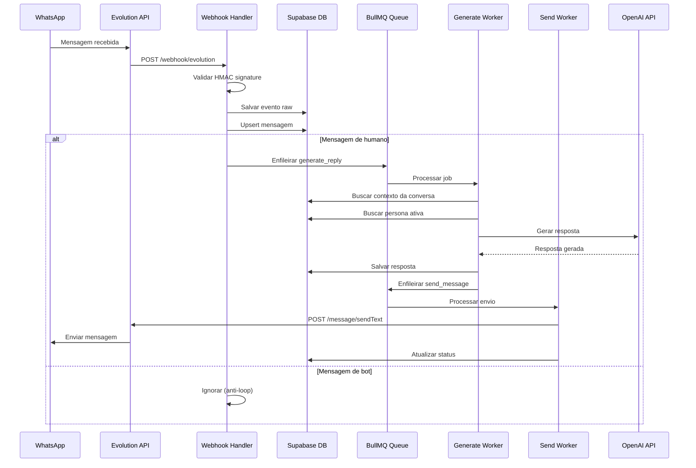

### 1.2 Fluxo de Erro e Retry

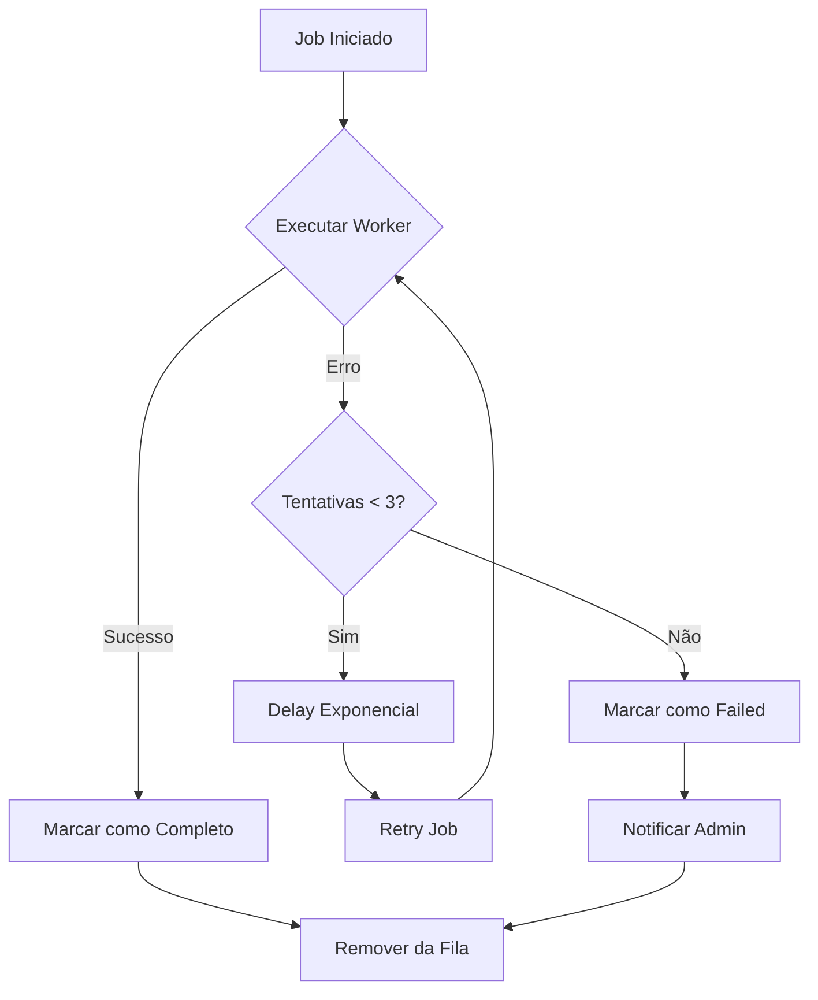

---

## 2. Fluxo de Onboarding: QR Code

### 2.1 Conexão de Nova Instância

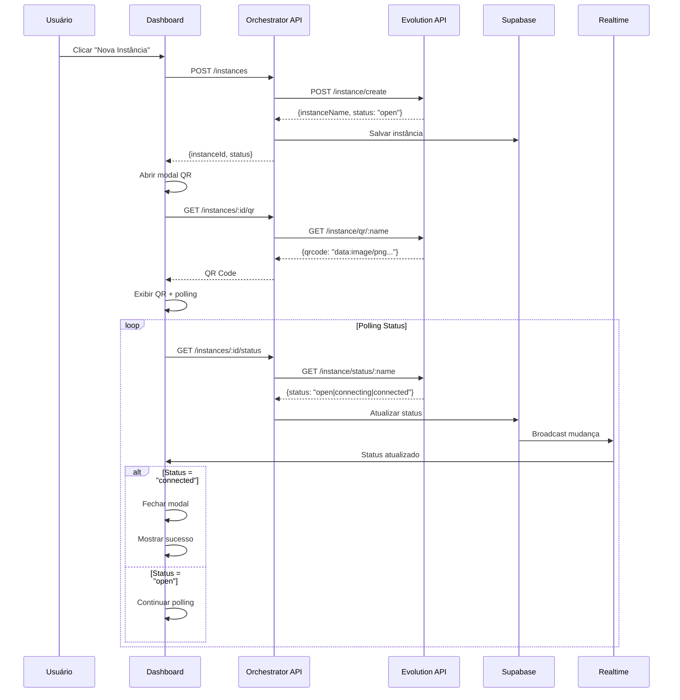

### 2.2 Estados da Instância

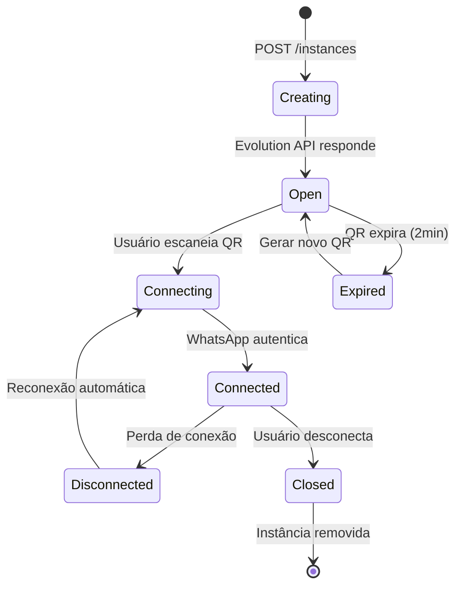

---

## 3. Conversation Scheduler

### 3.1 Execução de Rounds Agendados

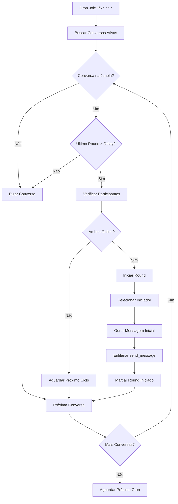

### 3.2 Lógica de Janelas de Tempo

```mermaid
gantt
    title Janelas de Conversa - Exemplo Semanal
    dateFormat HH:mm
    axisFormat %H:%M
    
    section Segunda
    Manhã    :active, 08:00, 11:00
    Tarde    :active, 14:00, 17:00
    Noite    :active, 19:00, 21:00
    
    section Terça
    Manhã    :active, 08:00, 11:00
    Tarde    :done, 14:00, 17:00
    Noite    :active, 19:00, 21:00
    
    section Quarta
    Manhã    :active, 08:00, 11:00
    Tarde    :active, 14:00, 17:00
    Noite    :crit, 19:00, 21:00
```

---

## 4. Sistema de Outreach

### 4.1 Fluxo de Outreach Controlado

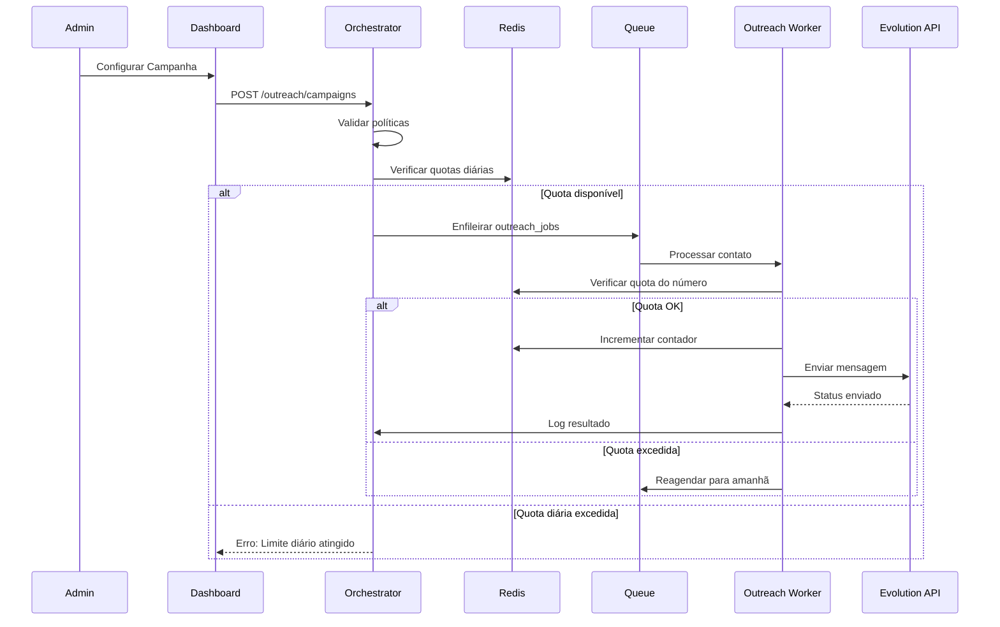

### 4.2 Sistema de Opt-out

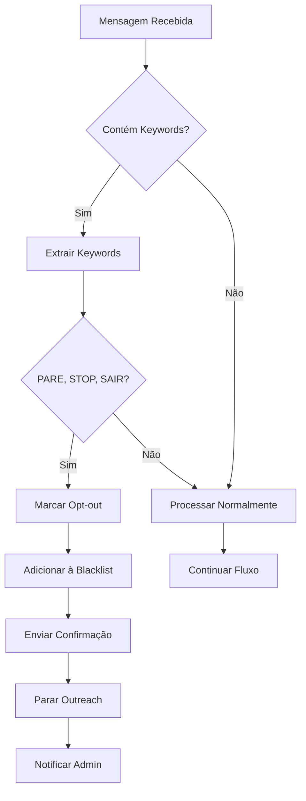

### 4.3 Controle de Quotas Redis

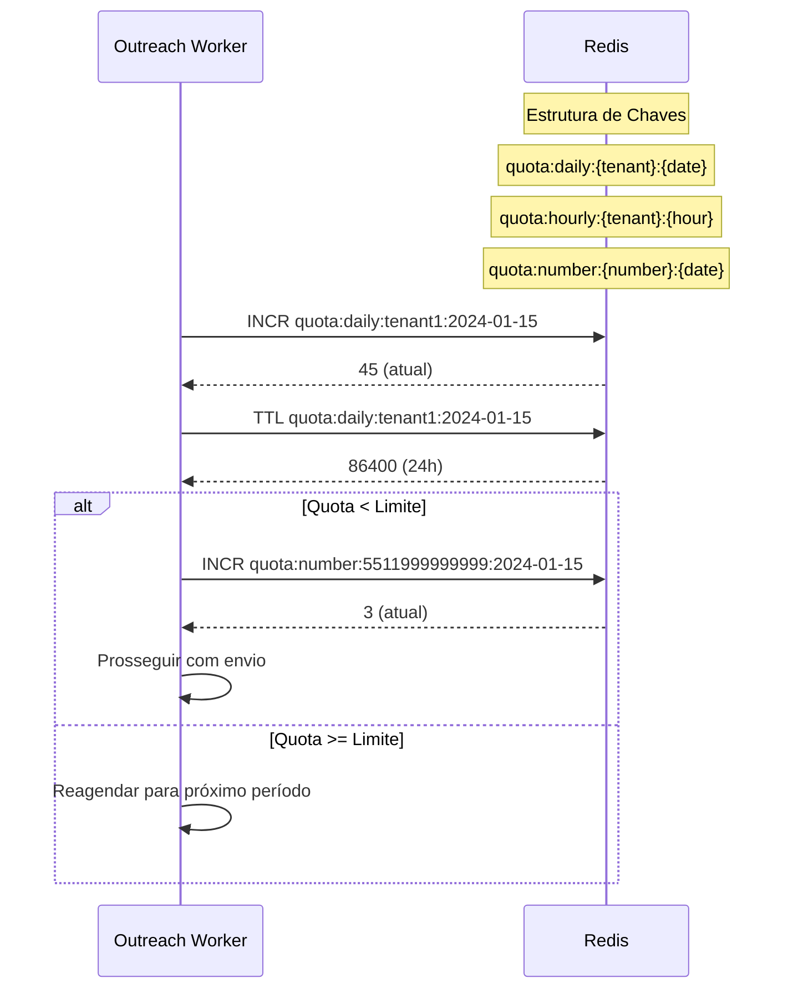

---

## 5. Fluxo de Métricas e Analytics

### 5.1 Agregação de Dados

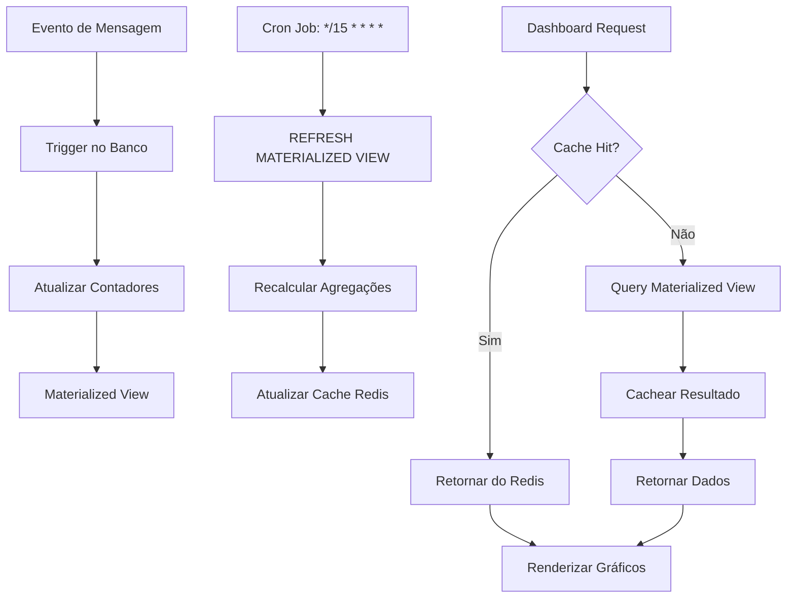

### 5.2 Estrutura de Métricas

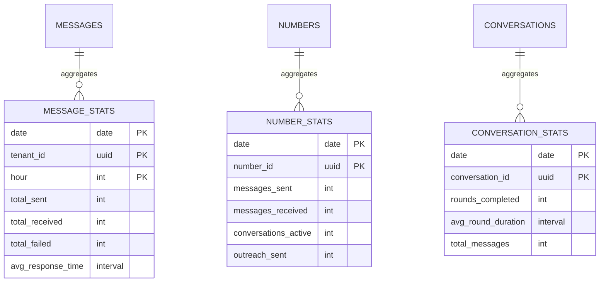

---

## 6. Fluxo de Segurança e Anti-Loop

### 6.1 Detecção de Loops

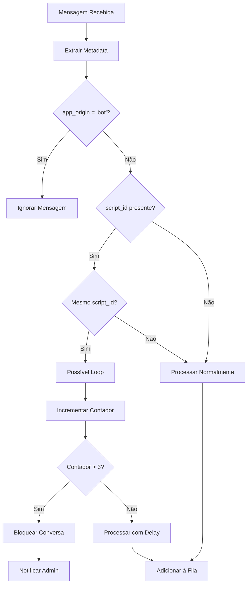

### 6.2 Rate Limiting por Tenant

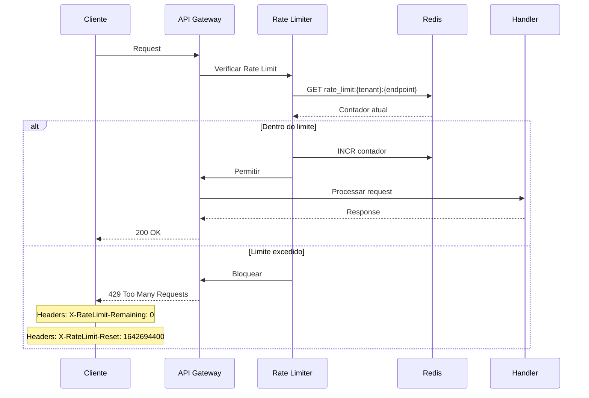

---

## 7. Fluxo de Deploy e Health Checks

### 7.1 Pipeline de Deploy

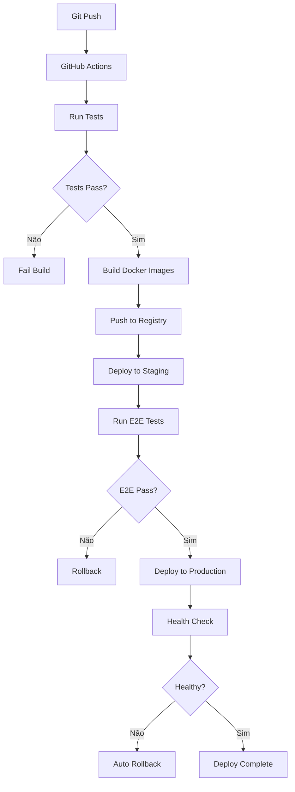

### 7.2 Health Check Endpoints

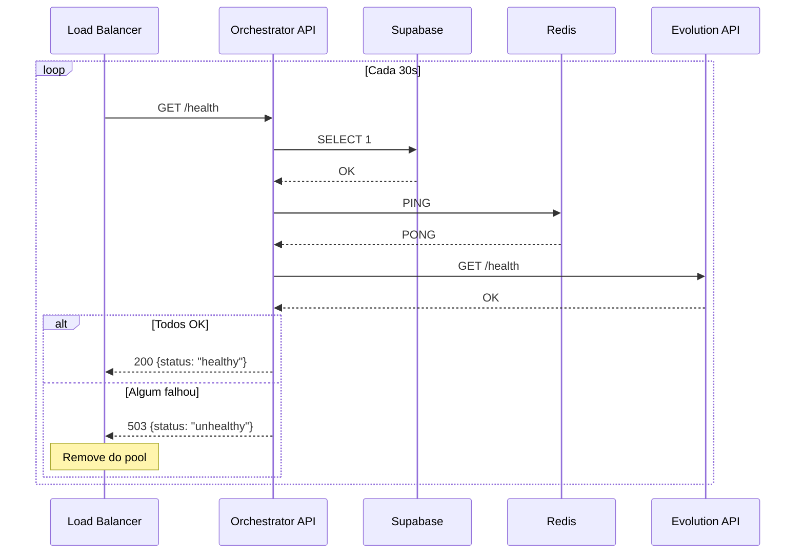

---

## 8. Fluxo de Backup e Recovery

### 8.1 Estratégia de Backup

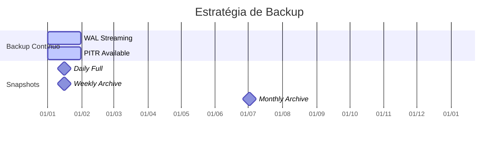

### 8.2 Procedimento de Recovery

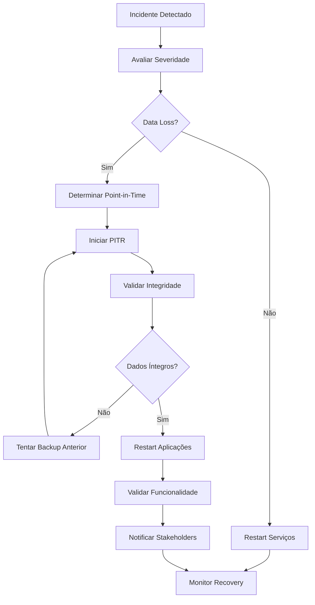

Esses diagramas cobrem os principais fluxos do sistema Mirage WhatsApp Orchestrator, desde o processamento básico de mensagens até procedimentos de backup e recovery. Cada diagrama pode ser usado como referência durante o desenvolvimento e para documentação técnica.