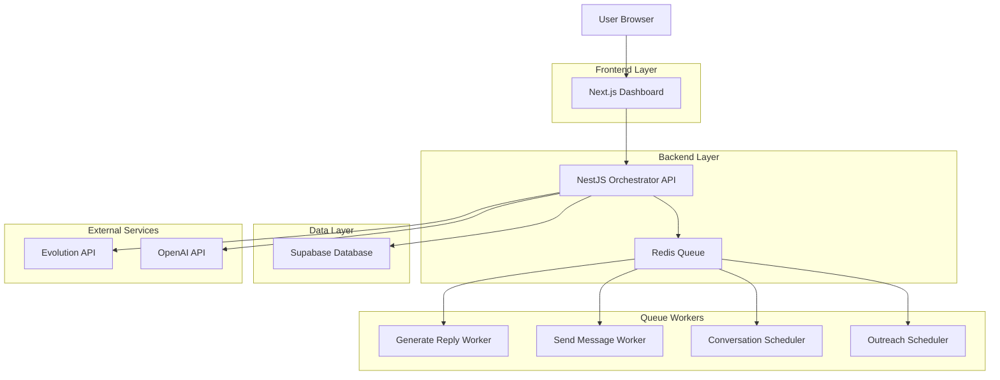
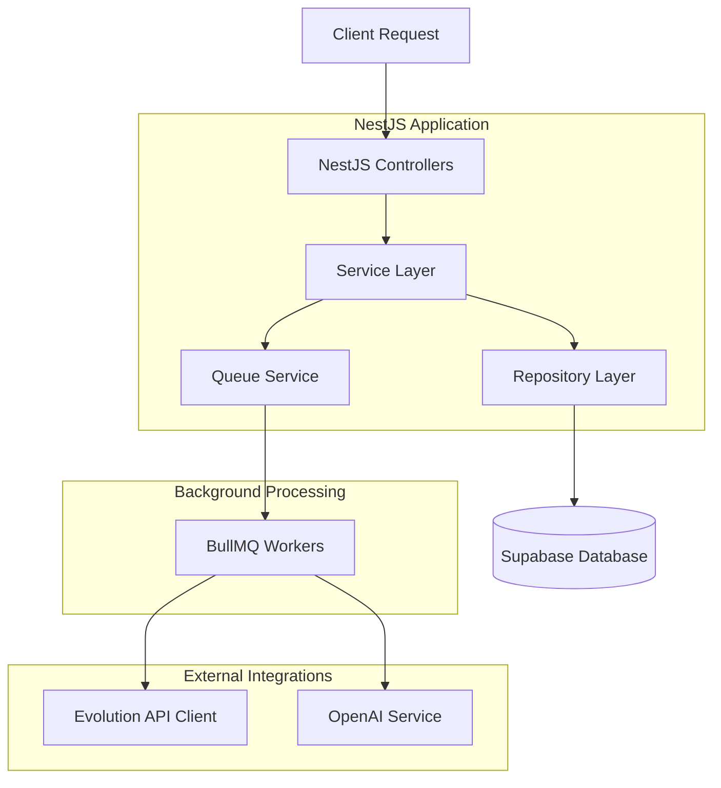
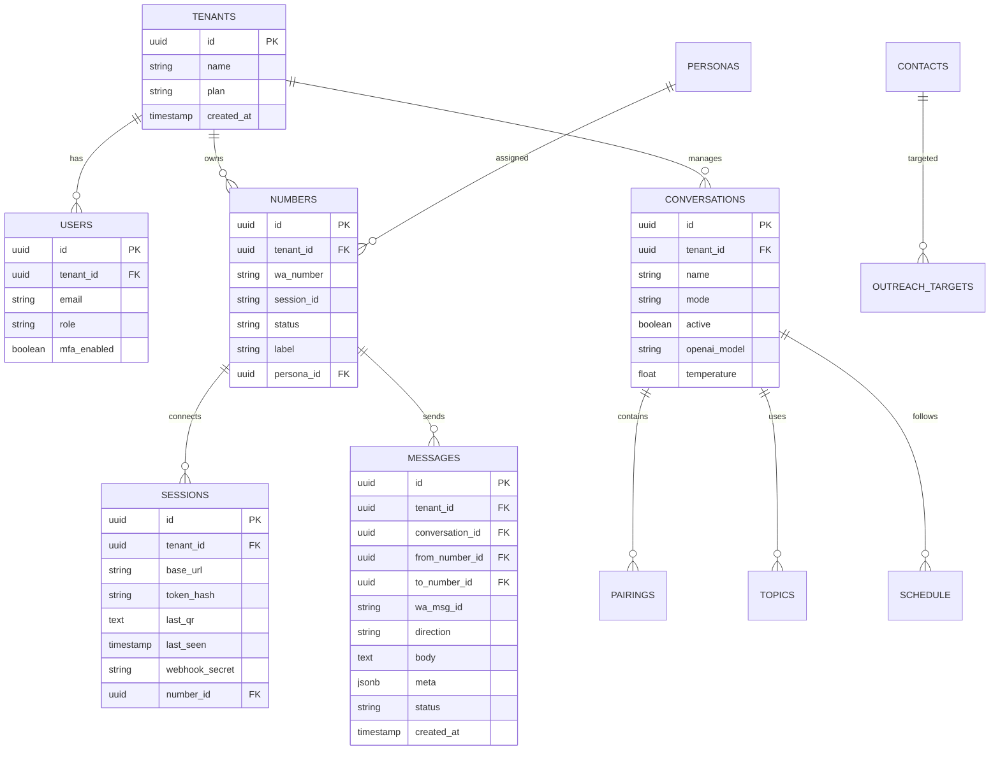

# Mirage WhatsApp Orchestrator - Documento de Arquitetura Técnica

## 1. Design da Arquitetura



## 2. Descrição das Tecnologias

- **Frontend**: Next.js@14 + Tailwind CSS@3 + shadcn/ui + Recharts + Framer Motion
- **Backend**: NestJS@10 + BullMQ@4 + Redis@7
- **Database**: Supabase (PostgreSQL) com Row Level Security
- **AI**: OpenAI GPT-4o-mini
- **External**: Evolution API para WhatsApp

## 3. Definições de Rotas

| Rota | Propósito |
|------|----------|
| / | Dashboard principal com visão geral das instâncias |
| /instances | Gerenciamento detalhado de instâncias WhatsApp |
| /conversations | Lista e configuração de conversas |
| /conversations/[id]/settings | Configurações específicas da conversa |
| /conversations/[id]/schedule | Agendamento de rounds por conversa |
| /conversations/[id]/participants | Gestão de participantes da conversa |
| /conversations/[id]/topics | Tópicos e prompts da conversa |
| /personas | CRUD de personas |
| /contacts | Gestão da base de contatos |
| /outreach/policies | Políticas de outreach |
| /outreach/targets | Targets de outreach |
| /settings | Configurações globais do tenant |
| /metrics | Dashboard de métricas e analytics |

## 4. Definições de API

### 4.1 Core API

**Gerenciamento de Instâncias**
```
POST /api/instances
```

Request:
| Param Name | Param Type | isRequired | Description |
|------------|------------|------------|-------------|
| label | string | true | Nome identificador da instância |
| persona_id | string | false | ID da persona padrão |

Response:
| Param Name | Param Type | Description |
|------------|------------|-------------|
| session_id | string | ID da sessão criada |
| qr_code | string | QR code base64 para conexão |

**Status de Instâncias**
```
GET /api/instances
```

Response:
| Param Name | Param Type | Description |
|------------|------------|-------------|
| instances | array | Lista de instâncias com status e métricas |

**Webhooks Evolution**
```
POST /api/webhooks/evolution
```

Request:
| Param Name | Param Type | isRequired | Description |
|------------|------------|------------|-------------|
| event | string | true | Tipo do evento (message, qr, connection) |
| instance | string | true | ID da instância |
| data | object | true | Payload do evento |

**Outreach Management**
```
POST /api/outreach/policies
```

Request:
| Param Name | Param Type | isRequired | Description |
|------------|------------|------------|-------------|
| number_id | string | true | ID do número para outreach |
| daily_limit | number | true | Limite diário de contatos |
| hourly_limit | number | true | Limite por hora |
| dayparts | array | true | Períodos permitidos ['morning', 'afternoon', 'evening'] |

Example:
```json
{
  "number_id": "uuid-123",
  "daily_limit": 50,
  "hourly_limit": 5,
  "dayparts": ["morning", "afternoon"]
}
```

## 5. Arquitetura do Servidor



## 6. Modelo de Dados

### 6.1 Definição do Modelo de Dados



### 6.2 Data Definition Language

**Tabela de Tenants**
```sql
-- Criar tabela de tenants
CREATE TABLE t_tenants (
    id UUID PRIMARY KEY DEFAULT gen_random_uuid(),
    name VARCHAR(255) NOT NULL,
    plan VARCHAR(50) DEFAULT 'free' CHECK (plan IN ('free', 'pro', 'enterprise')),
    created_at TIMESTAMP WITH TIME ZONE DEFAULT NOW()
);

-- Habilitar RLS
ALTER TABLE t_tenants ENABLE ROW LEVEL SECURITY;

-- Política RLS para tenants
CREATE POLICY "Tenants can only see their own data" ON t_tenants
    FOR ALL USING (id::text = auth.jwt() ->> 'app.tenant_id');
```

**Tabela de Usuários**
```sql
-- Criar tabela de usuários
CREATE TABLE t_users (
    id UUID PRIMARY KEY DEFAULT gen_random_uuid(),
    tenant_id UUID NOT NULL REFERENCES t_tenants(id) ON DELETE CASCADE,
    email VARCHAR(255) UNIQUE NOT NULL,
    role VARCHAR(50) DEFAULT 'operator' CHECK (role IN ('admin', 'operator', 'viewer')),
    mfa_enabled BOOLEAN DEFAULT false,
    created_at TIMESTAMP WITH TIME ZONE DEFAULT NOW()
);

-- Habilitar RLS
ALTER TABLE t_users ENABLE ROW LEVEL SECURITY;

-- Política RLS para usuários
CREATE POLICY "Users can only access their tenant data" ON t_users
    FOR ALL USING (tenant_id::text = auth.jwt() ->> 'app.tenant_id');
```

**Tabela de Números WhatsApp**
```sql
-- Criar enum para status
CREATE TYPE number_status AS ENUM ('disconnected', 'connecting', 'connected', 'error');

-- Criar tabela de números
CREATE TABLE t_numbers (
    id UUID PRIMARY KEY DEFAULT gen_random_uuid(),
    tenant_id UUID NOT NULL REFERENCES t_tenants(id) ON DELETE CASCADE,
    wa_number VARCHAR(20) NOT NULL,
    session_id VARCHAR(100),
    status number_status DEFAULT 'disconnected',
    label VARCHAR(255),
    persona_id UUID,
    created_at TIMESTAMP WITH TIME ZONE DEFAULT NOW(),
    updated_at TIMESTAMP WITH TIME ZONE DEFAULT NOW()
);

-- Índices
CREATE INDEX idx_numbers_tenant_id ON t_numbers(tenant_id);
CREATE INDEX idx_numbers_session_id ON t_numbers(session_id);
CREATE INDEX idx_numbers_status ON t_numbers(status);

-- Habilitar RLS
ALTER TABLE t_numbers ENABLE ROW LEVEL SECURITY;

-- Política RLS
CREATE POLICY "Numbers tenant isolation" ON t_numbers
    FOR ALL USING (tenant_id::text = auth.jwt() ->> 'app.tenant_id');
```

**Tabela de Mensagens**
```sql
-- Criar enum para direção
CREATE TYPE msg_direction AS ENUM ('in', 'out');

-- Criar tabela de mensagens
CREATE TABLE t_messages (
    id UUID PRIMARY KEY DEFAULT gen_random_uuid(),
    tenant_id UUID NOT NULL REFERENCES t_tenants(id) ON DELETE CASCADE,
    conversation_id UUID,
    from_number_id UUID REFERENCES t_numbers(id),
    to_number_id UUID REFERENCES t_numbers(id),
    wa_msg_id VARCHAR(255) UNIQUE,
    direction msg_direction NOT NULL,
    body TEXT,
    meta JSONB DEFAULT '{}',
    status VARCHAR(50) DEFAULT 'sent',
    created_at TIMESTAMP WITH TIME ZONE DEFAULT NOW()
);

-- Índices para performance
CREATE INDEX idx_messages_tenant_id ON t_messages(tenant_id);
CREATE INDEX idx_messages_conversation_id ON t_messages(conversation_id);
CREATE INDEX idx_messages_created_at ON t_messages(created_at DESC);
CREATE INDEX idx_messages_wa_msg_id ON t_messages(wa_msg_id);

-- Habilitar RLS
ALTER TABLE t_messages ENABLE ROW LEVEL SECURITY;

-- Política RLS
CREATE POLICY "Messages tenant isolation" ON t_messages
    FOR ALL USING (tenant_id::text = auth.jwt() ->> 'app.tenant_id');
```

**View de Estatísticas**
```sql
-- View materializada para estatísticas de mensagens
CREATE MATERIALIZED VIEW mv_stats_messages AS
SELECT 
    tenant_id,
    DATE(created_at) as date,
    direction,
    COUNT(*) as message_count,
    COUNT(DISTINCT from_number_id) as unique_senders
FROM t_messages 
WHERE created_at >= CURRENT_DATE - INTERVAL '30 days'
GROUP BY tenant_id, DATE(created_at), direction;

-- Índice na view
CREATE INDEX idx_mv_stats_messages_tenant_date ON mv_stats_messages(tenant_id, date);

-- Função para refresh automático
CREATE OR REPLACE FUNCTION refresh_message_stats()
RETURNS void AS $$
BEGIN
    REFRESH MATERIALIZED VIEW CONCURRENTLY mv_stats_messages;
END;
$$ LANGUAGE plpgsql;
```

**Dados Iniciais**
```sql
-- Inserir tenant padrão para desenvolvimento
INSERT INTO t_tenants (id, name, plan) 
VALUES ('00000000-0000-0000-0000-000000000001', 'Default Tenant', 'pro');

-- Inserir usuário admin padrão
INSERT INTO t_users (tenant_id, email, role, mfa_enabled)
VALUES (
    '00000000-0000-0000-0000-000000000001',
    'admin@mirage.local',
    'admin',
    false
);
```